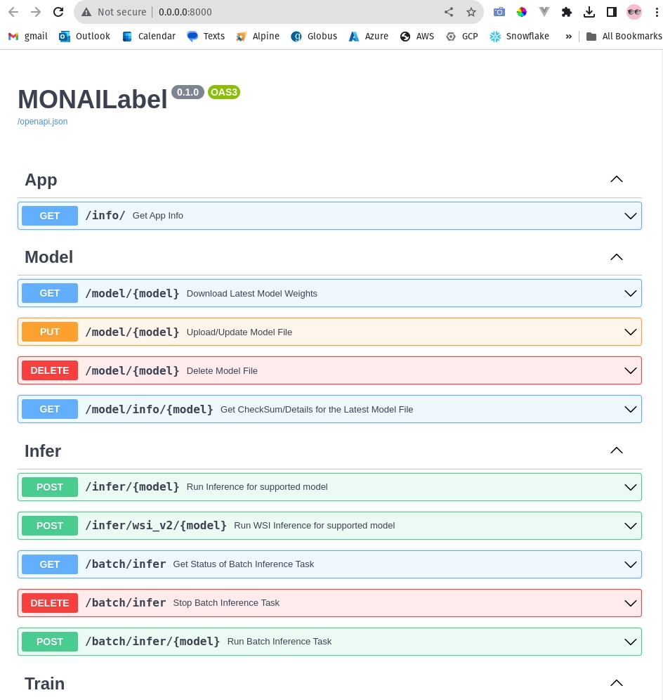

# MonaiLabelExploration
Get MonaiLabel server running and establish an input output workflow

## Initial Steps
[Docs](https://docs.monai.io/projects/label/en/latest/quickstart.html)

```bash
pyenv versions
pyenv virtualenv 3.10.4 monailabel-3.10.4

# Poetry
poetry config virtualenvs.create false
poetry config virtualenvs.in-project false
poetry add monailabel pandas

# install MONAI Label
pip install monailabel

# Download Sample Apps
monailabel apps # List sample apps
monailabel apps --download --name radiology --output apps
# monailabel apps --download --name pathology --output apps

# Download MSD Datasets
monailabel datasets # List sample datasets
monailabel datasets --download --name Task09_Spleen --output datasets
monailabel datasets --download --name Task01_BrainTumour --output datasets

# Run Deepedit Model.
# Options can be (deepedit|deepgrow|segmentation|segmentation_spleen|all) in case of radiology app.
# You can also pass comma separated models like --conf models deepedit,segmentation

# monailabel start_server --app apps/radiology --studies datasets/Task09_Spleen/imagesTr --conf models all
# monailabel start_server --app apps/radiology --studies datasets/Task09_Spleen/imagesTr --conf models deepedit
monailabel start_server --app apps/radiology --studies datasets/Task01_BrainTumour/imagesTr --conf models deepedit
```




## Curl Commands
Use http://<>:<>/#/ to explore the api and generate curl commands in the correct format.


### Workflow 
[ApplicationDeployment](https://docs.monai.io/projects/label/en/latest/appdeployment.html)

#### Client Init
```bash
curl -X 'GET' \
  'http://0.0.0.0:8000/info/' \
  -H 'accept: application/json'
```

#### Get Images
```bash
curl -X 'GET' \
  'http://0.0.0.0:8000/datastore/?output=all' \
  -H 'accept: application/json'
```

#### Next Image Selection (Not finalized)
```bash
curl -X 'POST' \
  'http://0.0.0.0:8000/activelearning/random' \
  -H 'accept: application/json' \
  -H 'Content-Type: application/json' \
  -d '{}'
```

#### Inference
```bash
# Works for 2D and 3D, though for 2D we used Brain Mets and the model is for general organs
# I believe when you look at the segmentation that is why it looks "strange"

# 2D (See test_requests.py for conversion of 3D *.nii.gz to 2D *.nii.gz)
curl -X 'POST' \
  'http://0.0.0.0:8000/infer/deepedit?output=image' \
  -H 'accept: application/json' \
  -H 'Content-Type: multipart/form-data' \
  -F 'params={}' \
  -F 'file=@datasets/Task01_BrainTumour/imagesTs/BRATS_485_slice-60.nii.gz;type=application/gzip' \
  -o TEMP_DATA/BRATS_485_slice_60_segmentation.nii.gz

# 3D Works with BRATS nii.gz images as is because they are 3D already
## datasets/Task01_BrainTumour/labelsTr/BRATS_485.nii.gz DID NOT EXIST ORIGINALLY!!!
curl -X 'POST' \
  'http://0.0.0.0:8000/infer/deepedit?output=image' \
  -H 'accept: application/json' \
  -H 'Content-Type: multipart/form-data' \
  -F 'params={}' \
  -F 'file=@datasets/Task01_BrainTumour/imagesTs/BRATS_485.nii.gz;type=application/gzip' \
  -o TEMP_DATA/BRATS_485_Segmentation.nii.gz
```

#### Submit Final Label
```bash


```

#### Train Model
```bash


```
